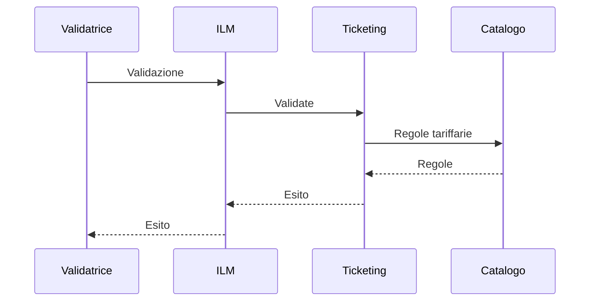

# Validazione titolo

Esempio dimostrativo di flusso di validazione.

```mermaid
sequenceDiagram
    participant V as Validatrice
    participant I as ILM
    participant T as Ticketing
    participant C as Catalogo
    V->>I: Validazione
    I->>T: Validate
    T->>C: Regole tariffarie
    C-->>T: Regole
    T-->>I: Esito
    I-->>V: Esito
```

## US-TKT-0001-1 — Verificare un titolo

Il sistema verifica la validità del titolo prima di confermare la transazione.
